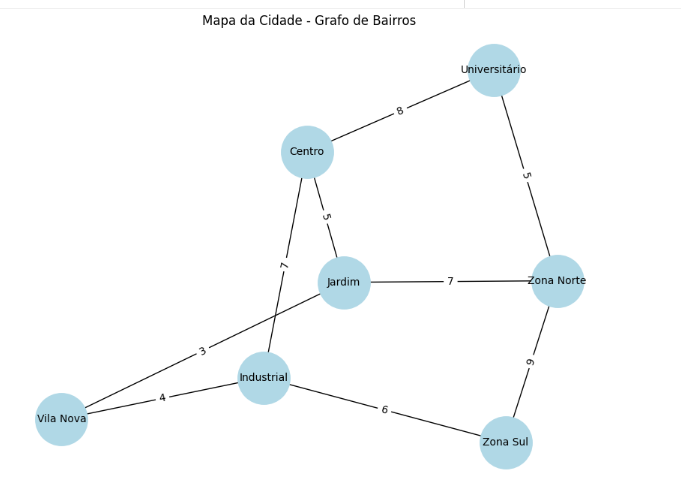
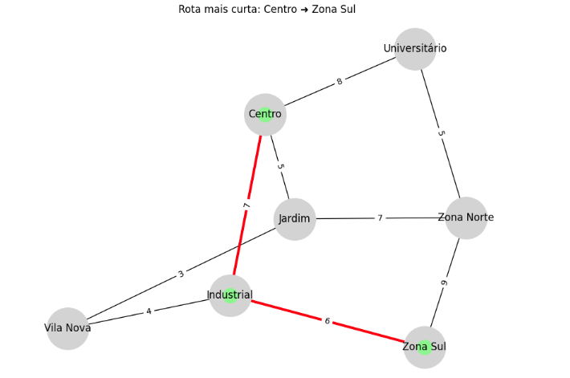
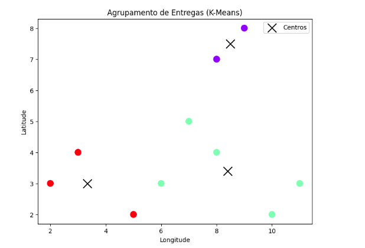

# 🧭 Rota Inteligente: Otimização de Entregas com IA  

### 💡 Disciplina: Artificial Intelligence Fundamentals  
### 👨‍💻 Autor: **Ryan Lima Ribeiro**

---

## 🧩 1. Descrição do Problema  

A empresa **Sabor Express**, um pequeno delivery de alimentos, enfrenta dificuldades para gerenciar suas entregas durante horários de pico.  
Os entregadores percorrem **rotas ineficientes**, o que causa:  

- Atrasos nas entregas;  
- Aumento dos custos de combustível;  
- Insatisfação dos clientes.  

O proprietário percebeu que, para continuar competitivo, seria necessário usar **Inteligência Artificial (IA)** para **otimizar as rotas de entrega** e **agrupar pedidos próximos** de forma inteligente.  

---

## 🎯 2. Objetivo do Projeto  

Desenvolver uma **solução inteligente em Python** que:  

1. **Encontre o menor caminho** entre os bairros de uma cidade fictícia, utilizando algoritmos de busca (A*).  
2. **Agrupe entregas próximas** usando aprendizado não supervisionado (**K-Means**).  
3. **Otimize o trabalho dos entregadores**, reduzindo tempo e custo de deslocamento.  

---

## ⚙️ 3. Abordagem e Algoritmos Utilizados  

### 🔹 **A* (A Estrela)**  
O algoritmo **A*** foi usado para encontrar a **rota mais curta** entre dois bairros.  
Ele combina custo real e estimado (heurística) para decidir o caminho mais eficiente.  

- Entrada: grafo com bairros e distâncias.  
- Saída: sequência ótima de bairros e distância total.  
- Exemplo de resultado:  
  ```
  Melhor rota: Centro → Industrial → Zona Sul  
  Distância total: 13 km
  ```

---

### 🔹 **K-Means Clustering**  
O algoritmo **K-Means** foi aplicado para **agrupar entregas próximas** em zonas de atuação, facilitando a distribuição entre os entregadores.  

- Entrada: coordenadas de entregas fictícias.  
- Saída: grupos (clusters) coloridos e centros de cada zona.  

O gráfico gerado mostra os clusters bem definidos, com cada cor representando uma zona de entrega.

---

## 🗺️ 4. Representação do Problema  

O mapa da cidade foi modelado como um **grafo**, onde:  
- **Nós (vértices):** bairros ou pontos de entrega;  
- **Arestas:** ruas com pesos (distâncias em km).  

Exemplo do grafo:  



---

## 🧮 5. Resultados Obtidos  

### 🚗 **Menor Caminho (A*)**
- Origem: **Centro**  
- Destino: **Zona Sul**  
- Rota encontrada: `Centro → Industrial → Zona Sul`  
- Distância total: **13 km**  



---

### 📦 **Agrupamento de Entregas (K-Means)**  
Foram definidos **3 clusters (zonas)** de entregas.  

- **Zona 1:** [[8,7], [9,8]]  
- **Zona 2:** [[10,2], [11,3], [6,3], [7,5], [8,4]]  
- **Zona 3:** [[2,3], [3,4], [5,2]]  



---

## 🧠 6. Análise e Conclusão  

✅ O algoritmo **A*** encontrou a menor rota possível entre os bairros selecionados, otimizando tempo e distância.  
✅ O **K-Means** agrupou entregas próximas, reduzindo o deslocamento entre pontos e equilibrando a carga de trabalho entre os entregadores.  
✅ A solução cumpre os princípios de **raciocínio analítico e otimização baseada em IA** propostos no desafio.  

### 🔍 Limitações:
- O mapa é estático (sem trânsito em tempo real);  
- As distâncias são fictícias;  
- Poderia ser expandido para usar **dados reais via API de mapas (Google Maps, OpenStreetMap, etc.)**.

---

## 🚀 7. Aplicações Reais  

Esse tipo de solução é amplamente usada por empresas como a **UPS**, que desenvolveu o sistema **ORION (On-Road Integrated Optimization and Navigation)** — responsável por economizar milhões de milhas e reduzir custos logísticos anualmente.

Referências sugeridas:
- [UPS ORION System – Wired](https://www.wired.com/2013/06/ups-astronomical-math)  
- [K-Means Clustering for Delivery Optimization – Medium](https://medium.com/@KingHenryMorgansDiary/optimizing-logistics-a-case-study-on-clustering-and-milp-for-delivery-route-optimization-f47fed709ad2)  

---

## 💻 8. Estrutura do Projeto  

```
📦 rota-inteligente/
 ┣ 📂 src/
 ┃ ┣ main.py
 ┣ 📂 docs/
 ┃ ┣ diagrama_grafo.png
 ┃ ┣ rota_mais_curta.png
 ┃ ┣ clustering.png
 ┣ README.md
 ┣ requirements.txt
 ┗ rota_inteligente.ipynb
```

---

## 🧩 9. Execução do Projeto  

### No Google Colab:
1. Acesse o arquivo `rota_inteligente.ipynb`;  
2. Execute todas as células em ordem;  
3. Serão exibidos:  
   - Gráfico do grafo da cidade;  
   - Rota ótima entre bairros;  
   - Gráfico de agrupamento (K-Means);  
   - Resultados e análise final.  

### Bibliotecas necessárias:
```bash
pip install networkx matplotlib scikit-learn numpy
```

---

## 🎥 10. Vídeo Pitch (até 4 minutos)

No vídeo, apresente:
1. O problema da empresa Sabor Express;  
2. A ideia da solução (A* + K-Means);  
3. O funcionamento do código e gráficos;  
4. A análise dos resultados e benefícios.  

---

## 🏁 11. Conclusão Final  

O projeto **Rota Inteligente** demonstra como a **Inteligência Artificial** pode transformar processos logísticos, melhorando eficiência e reduzindo custos.  
Mesmo com dados simulados, a abordagem prova o poder dos **algoritmos de busca e clustering** na otimização de rotas — conceito amplamente aplicado no mundo real.

---

## ✨ Autor  

**Ryan Lima Ribeiro**  
Curso: Gestão da Tecnologia da Informação  
Disciplina: *Artificial Intelligence Fundamentals*  
